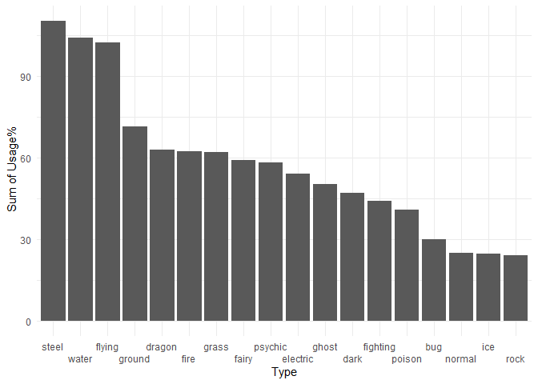
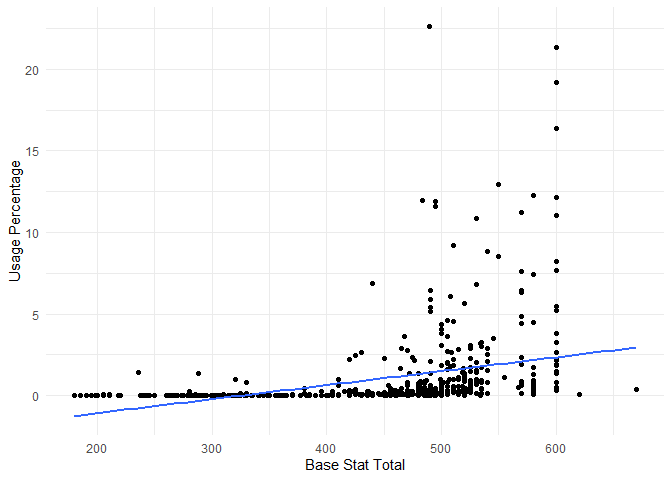
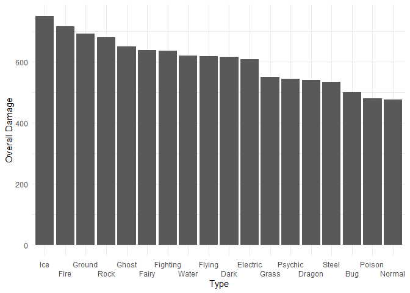

Pokemon Stats Gen8 OU
================
Edward DeWane
2023-10-23

Data Prep

``` r
# this file is the usage statistics of pokemon used comptetitively in August 2023.
usage <- read.delim("https://www.smogon.com/stats/2023-08/gen8ou-0.txt" ,sep ="|", header = FALSE)

# the following files were downloaded from github, and they contain general information about pokemon
pokemon <- read.csv("C:/Users/edewa/Downloads/Pokemon Project Data/pokemon.csv")

typeids <- read.csv("C:/Users/edewa/Downloads/Pokemon Project Data/types.csv")

pokemontypes <- read.csv("C:/Users/edewa/Downloads/Pokemon Project Data/pokemon_types.csv")

stats <- read.csv("C:/Users/edewa/Downloads/pokemon_stats.csv")

typechart <- read.csv("C:/Users/edewa/Downloads/Pokemon Project Data/typechart.csv")

#pivoting data so there is only 1 row for each pokemon
pokemontypes <- reshape(pokemontypes, idvar = "pokemon_id", timevar = "slot", direction = "wide")

#changing out numbers type id numbers with type names
test2 <- merge(pokemontypes, typeids, by.x = "type_id.1", by.y = "id" )


test3 <- merge(pokemontypes, typeids, by.x = "type_id.2", by.y = "id", all = TRUE )

## these rows are special types that are only in spinoff games
test3 <- test3[-c(585,584),]

colnames(test2)[4] = "type1"
colnames(test3)[4] = "type2"
test2 <- test2[,c(2,4)]
test3 <- test3[,c(2,4)]


test4 <- merge(test2, test3, by = "pokemon_id")

pokemondf <- pokemon[,c(1,2)]


pokemondf <-  merge(pokemondf, test4, by.x = "id", by.y = "pokemon_id")

#pokemon df now contains all pokemon's names, id number, and type(s)

#the usage data needs lots of reformatting
usage <- usage[-c(1,2,3,5, 652),]
usage <- usage[,-1]
library(janitor)
```

    ## 
    ## Attaching package: 'janitor'

    ## The following objects are masked from 'package:stats':
    ## 
    ##     chisq.test, fisher.test

``` r
usage <- usage %>% 
  row_to_names(row_number = 1)
```

    ## Warning: Row 1 does not provide unique names. Consider running clean_names()
    ## after row_to_names().

``` r
usage <- usage[,c(2,3)]

# need to make the usage percent into numeric data
usage$` Usage %   ` <- gsub("%", "", usage$` Usage %   `)
colnames(usage)[2] <- "usage%"

usage$`usage%` <- as.numeric(usage$`usage%`)

#renaming columns for ease of use
colnames(usage)[1] <- "pokemon"
colnames(usage)[2] <- "usage_pct"

#have to make pokemon names match so that the data can be merged.

usage$pokemon <- toupper(usage$pokemon)
pokemondf$identifier <- toupper(pokemondf$identifier)


## the names are mostly the same, but there are about 40ish pokemon that I have to manually make match
usage$pokemon <- gsub("'", "", usage$pokemon)

usage$pokemon <- gsub("%", "", usage$pokemon)

usage$pokemon <- gsub("MEOWSTIC", "MEOWSTIC-MALE", usage$pokemon)

usage$pokemon <- gsub("INDEEDEE-F", "INDEEDEE-FEMALE", usage$pokemon)

pokemondf$identifier <- gsub("INDEEDEE-MALE" , "INDEEDEE", pokemondf$identifier)

pokemondf[nrow(pokemondf),] = c("","SILVALLY-STEEL","steel",NA)
pokemondf[nrow(pokemondf)+1,] = c("","SILVALLY-ELECTRIC","electric",NA)
pokemondf[nrow(pokemondf)+1,] = c("","SILVALLY-WATER","water",NA)
pokemondf[nrow(pokemondf)+1,] = c("","SILVALLY-GROUND","ground",NA)
pokemondf[nrow(pokemondf)+1,] = c("","SILVALLY-DRAGON","dragon",NA)
pokemondf[nrow(pokemondf)+1,] = c("","SILVALLY-DARK","dark",NA)
pokemondf[nrow(pokemondf)+1,] = c("","SILVALLY-FAIRY","fairy",NA)
pokemondf[nrow(pokemondf)+1,] = c("","SILVALLY-POISON","poison",NA)
pokemondf[nrow(pokemondf)+1,] = c("","SILVALLY-GHOST","ghost",NA)
pokemondf[nrow(pokemondf)+1,] = c("","SILVALLY-GRASS","GRASS",NA)
pokemondf[nrow(pokemondf)+1,] = c("","SILVALLY-FIGHTING","fighting",NA)
pokemondf[nrow(pokemondf)+1,] = c("","SILVALLY-FLYING","flying",NA)
pokemondf[nrow(pokemondf)+1,] = c("","SILVALLY-ICE","ice",NA)
pokemondf[nrow(pokemondf)+1,] = c("","SILVALLY-PSYCHIC","psychic",NA)
pokemondf[nrow(pokemondf)+1,] = c("","SILVALLY-FIRE","fire",NA)
pokemondf[nrow(pokemondf)+1,] = c("","SILVALLY-BUG","bug",NA)
pokemondf$type1 <- gsub("GRASS", "grass", pokemondf$type1)

usage$pokemon <- gsub(" ", "", usage$pokemon)
usage$pokemon <- gsub("AEGISLASH", "AEGISLASH-BLADE", usage$pokemon)
usage$pokemon <- gsub("BASCULIN", "BASCULIN-RED-STRIPED", usage$pokemon)
usage$pokemon <- gsub("DARMANITAN", "DARMANITAN-STANDARD", usage$pokemon)
usage$pokemon <- gsub("EISCUE", "EISCUE-ICE", usage$pokemon)
usage$pokemon <- gsub("GOURGEIST", "GOURGEIST-AVERAGE", usage$pokemon)
usage$pokemon <- gsub("KELDEO", "KELDEO-ORDINARY", usage$pokemon)
usage$pokemon <- gsub("-AVERAGE-", "-", usage$pokemon)
pokemondf$identifier <- gsub("LYCANROC-MIDDAY", "LYCANROC", pokemondf$identifier)
usage$pokemon <- gsub("MIMEJR.", "MIME-JR", usage$pokemon)
usage$pokemon <- gsub("MIMIKYU", "MIMIKYU-BUSTED", usage$pokemon)
usage$pokemon <- gsub("MR.", "MR-", usage$pokemon)
usage$pokemon <- gsub("MORPEKO", "MORPEKO-HANGRY", usage$pokemon)
usage$pokemon <- gsub("NIDORANM", "NIDORAN-M", usage$pokemon)
usage$pokemon <- gsub("TAPU", "TAPU-", usage$pokemon)
pokemondf$identifier <- gsub("-INCARNATE", "", pokemondf$identifier)
usage$pokemon <- gsub("TOXTRICITY", "TOXTRICITY-AMPED", usage$pokemon)
usage$pokemon <- gsub(":", "-", usage$pokemon)
usage$pokemon <- gsub("WISHIWASHI", "WISHIWASHI-SCHOOL", usage$pokemon)


#finally we can merge!

pokemon_type_usage <-  merge(usage, pokemondf, by.x = "pokemon", by.y = "identifier", all.x = TRUE, all.y = FALSE)


# lets also merge the base stat total while we're at it.
stats <- aggregate(stats$base_stat~stats$pokemon_id, FUN = 'sum')

colnames(stats)[1] = "id"

colnames(stats)[2] = "stats"

pokemon_usage_bst <-  merge(pokemon_type_usage, stats, by.x = "id", by.y = "id")

# we lose about 17 pokemon in this merge because the data with pokemon ids does not give one for each silvally form, but Silvally is not even remotely relevant so I don't care.
```

What percent of teams have each Pokemon?

``` r
pokemon_type_usage[order(-pokemon_type_usage$usage_pct),]
```

    ##                  pokemon usage_pct    id    type1    type2
    ## 179           FERROTHORN  22.60491   598    grass    steel
    ## 282     LANDORUS-THERIAN  21.31014 10021   ground   flying
    ## 133            DRAGAPULT  19.20730   887   dragon    ghost
    ## 193             GARCHOMP  16.36568   445   dragon   ground
    ## 596 URSHIFU-RAPID-STRIKE  12.94537 10191 fighting    water
    ## 637               ZAPDOS  12.25141   145 electric   flying
    ## 235              HEATRAN  12.15884   485     fire    steel
    ## 86              CLEFABLE  11.95741    36    fairy     <NA>
    ## 580              TOXAPEX  11.88871   748   poison    water
    ## 101          CORVIKNIGHT  11.59995   823   flying    steel
    ## 267              KARTANA  11.25297   798    grass    steel
    ## 333             MELMETAL  11.06725   809    steel     <NA>
    ## 442            RILLABOOM  10.87979   812    grass     <NA>
    ## 618              WEAVILE   9.18332   461     dark      ice
    ## 49               BLISSEY   8.81771   242   normal     <NA>
    ## 610            VOLCARONA   8.54350   637      bug     fire
    ## 591            TYRANITAR   8.22447   248     rock     dark
    ## 135            DRAGONITE   7.68711   149   dragon   flying
    ## 560            TAPU-LELE   7.60677   786  psychic    fairy
    ## 578     TORNADUS-THERIAN   7.41174 10019   flying     <NA>
    ## 393             PELIPPER   6.87497   279    water   flying
    ## 47              BLAZIKEN   6.79055   257     fire fighting
    ## 517              SLOWBRO   6.47385    80    water  psychic
    ## 559            TAPU-KOKO   6.46686   785 electric    fairy
    ## 45           BLACEPHALON   6.33005   806     fire    ghost
    ## 170            EXCADRILL   6.08786   530   ground    steel
    ## 37           BARRASKEWDA   5.92019   847    water     <NA>
    ## 455           ROTOM-WASH   5.67044 10009 electric    water
    ## 640              ZERAORA   5.44222   807 electric     <NA>
    ## 44               BISHARP   5.38575   625     dark    steel
    ## 342                  MEW   5.21343   151  psychic     <NA>
    ## 520       SLOWKING-GALAR   5.13891 10172   poison  psychic
    ## 558            TAPU-FINI   4.84607   788    water    fairy
    ## 375      NINETALES-ALOLA   4.62601 10104      ice    fairy
    ## 229            HATTERENE   4.52413   858  psychic    fairy
    ## 433            REGIELEKI   4.50200   894 electric     <NA>
    ## 64              BUZZWOLE   4.44495   794      bug fighting
    ## 5        AEGISLASH-BLADE   4.34249 10026    steel    ghost
    ## 197               GENGAR   4.08109    94    ghost   poison
    ## 605              VICTINI   3.82260   494  psychic     fire
    ## 471               SCIZOR   3.79407   212      bug    steel
    ## 367             NIDOKING   3.64387    34   poison   ground
    ## 107            CRAWDAUNT   3.63339   342    water     dark
    ## 572             TOGEKISS   3.48319   468    fairy   flying
    ## 549             SWAMPERT   3.25730   260    water   ground
    ## 609            VOLCANION   3.24216   721     fire    water
    ## 75             CHARIZARD   3.18802     6     fire   flying
    ## 241            HIPPOWDON   3.07974   450   ground     <NA>
    ## 232             HAWLUCHA   3.05645   701 fighting   flying
    ## 319            MAGNEZONE   3.03840   462 electric    steel
    ## 89              CLOYSTER   3.03491    91    water      ice
    ## 603             VENUSAUR   2.90741     3    grass   poison
    ## 512             SKARMORY   2.90392   227    steel   flying
    ## 225             GYARADOS   2.90042   130    water   flying
    ## 416             PORYGON2   2.80611   233   normal     <NA>
    ## 576              TORKOAL   2.76943   324     fire     <NA>
    ## 490              SHUCKLE   2.73858   213      bug     rock
    ## 422             QUAGSIRE   2.67221   195    water   ground
    ## 248            HYDREIGON   2.65533   635     dark   dragon
    ## 481           SEISMITOAD   2.63029   537    water   ground
    ## 527              SNORLAX   2.49988   143   normal     <NA>
    ## 330        MAROWAK-ALOLA   2.43875 10115     fire    ghost
    ## 196            GASTRODON   2.36831   423    water   ground
    ## 71            CELESTEELA   2.36598   797    steel   flying
    ## 74               CHANSEY   2.25537   113   normal     <NA>
    ## 302              LUCARIO   2.25420   448 fighting    steel
    ## 459            SALAMENCE   2.24605   373   dragon   flying
    ## 32             AZUMARILL   2.20181   184    water    fairy
    ## 218           GRIMMSNARL   2.19948   861     dark    fairy
    ## 339            METAGROSS   2.17386   376    steel  psychic
    ## 349       MIMIKYU-BUSTED   2.15174 10143    ghost    fairy
    ## 346              MILOTIC   2.10691   350    water     <NA>
    ## 519             SLOWKING   2.09585   199    water  psychic
    ## 250           INCINEROAR   2.04811   727     fire     dark
    ## 131            DRACOZOLT   2.02133   880 electric   dragon
    ## 96            CONKELDURR   1.99280   534 fighting     <NA>
    ## 372             NIHILEGO   1.90955   793     rock   poison
    ## 276              KOMMO-O   1.88627   784   dragon fighting
    ## 108            CRESSELIA   1.85425   488  psychic     <NA>
    ## 8               ALAKAZAM   1.83969    65  psychic     <NA>
    ## 322            MANDIBUZZ   1.83387   630     dark   flying
    ## 410          POLTEAGEIST   1.82281   855    ghost     <NA>
    ## 556            TANGROWTH   1.74538   465    grass     <NA>
    ## 168               ESPEON   1.73490   196  psychic     <NA>
    ## 638         ZAPDOS-GALAR   1.73257 10170 fighting   flying
    ## 278           KROOKODILE   1.69473   553   ground     dark
    ## 12             AMOONGUSS   1.69240   591    grass   poison
    ## 21             ARCTOZOLT   1.61439   881 electric      ice
    ## 321            MAMOSWINE   1.53754   473      ice   ground
    ## 269              KINGDRA   1.53288   230    water   dragon
    ## 233              HAXORUS   1.52357   612   dragon     <NA>
    ## 594              UMBREON   1.51483   197     dark     <NA>
    ## 46             BLASTOISE   1.50144     9    water     <NA>
    ## 258              JIRACHI   1.50144   385    steel  psychic
    ## 194            GARDEVOIR   1.44555   282  psychic    fairy
    ## 483             SHEDINJA   1.42460   292      bug    ghost
    ## 254             INTELEON   1.39840   818    water     <NA>
    ## 191           GALVANTULA   1.38967   596      bug electric
    ## 288               LATIOS   1.38093   381   dragon  psychic
    ## 128                DITTO   1.37977   132   normal     <NA>
    ## 461             SALAZZLE   1.37919   758   poison     fire
    ## 453           ROTOM-HEAT   1.37162 10008 electric     fire
    ## 438            REUNICLUS   1.36347   579  psychic     <NA>
    ## 117  DARMANITAN-STANDARD   1.33843   555     fire     <NA>
    ## 352        MOLTRES-GALAR   1.31515 10171     dark   flying
    ## 73            CHANDELURE   1.21443   609    ghost     fire
    ## 449             ROSERADE   1.13700   407    grass   poison
    ## 17              ARCANINE   1.09974    59     fire     <NA>
    ## 184               FLYGON   1.09159   330   ground   dragon
    ## 510            SIRFETCHD   1.02464   865 fighting     <NA>
    ## 344             MIENSHAO   1.02114   620 fighting     <NA>
    ## 6             AERODACTYL   1.00484   142     rock   flying
    ## 417            PRIMARINA   0.98912   730    water    fairy
    ## 100        CORSOLA-GALAR   0.98156 10173    ghost     <NA>
    ## 401              PIKACHU   0.97399    25 electric     <NA>
    ## 643              ZOROARK   0.97341   571     dark     <NA>
    ## 554           TALONFLAME   0.97050   663     fire   flying
    ## 547              SUICUNE   0.95536   245    water     <NA>
    ## 601             VAPOREON   0.95303   134    water     <NA>
    ## 308        LYCANROC-DUSK   0.95187 10152     rock     <NA>
    ## 415            PORYGON-Z   0.95070   474   normal     <NA>
    ## 537              STARMIE   0.92043   121    water  psychic
    ## 568    THUNDURUS-THERIAN   0.90878 10020 electric   flying
    ## 472            SCOLIPEDE   0.90238   545      bug   poison
    ## 380            OBSTAGOON   0.89598   862     dark   normal
    ## 633            XURKITREE   0.86396   796 electric     <NA>
    ## 320              MALAMAR   0.85697   687     dark  psychic
    ## 207            GOLISOPOD   0.85115   768      bug    water
    ## 284               LAPRAS   0.84707   131    water      ice
    ## 440            RHYPERIOR   0.84707   464   ground     rock
    ## 583     TOXTRICITY-AMPED   0.84358   849 electric   poison
    ## 110               CROBAT   0.83834   169   poison   flying
    ## 209               GOODRA   0.83077   706   dragon     <NA>
    ## 470             SCEPTILE   0.82844   254    grass     <NA>
    ## 24                  ARON   0.82437   304    steel     rock
    ## 7                 AGGRON   0.82029   306    steel     rock
    ## 557            TAPU-BULU   0.81505   787    grass    fairy
    ## 162           ELECTIVIRE   0.80865   466 electric     <NA>
    ## 374            NINETALES   0.80690    38     fire     <NA>
    ## 273               KLEFKI   0.80457   707    steel    fairy
    ## 553              SYLVEON   0.78536   700    fairy     <NA>
    ## 351              MOLTRES   0.75800   146     fire   flying
    ## 533            SPIRITOMB   0.75625   442    ghost     dark
    ## 406             POLITOED   0.75276   186    water     <NA>
    ## 303             LUDICOLO   0.74403   272    water    grass
    ## 259              JOLTEON   0.73937   135 electric     <NA>
    ## 238            HERACROSS   0.68988   214      bug fighting
    ## 236            HELIOLISK   0.66951   695 electric   normal
    ## 436            REGISTEEL   0.66485   379    steel     <NA>
    ## 118            DECIDUEYE   0.66252   724    grass    ghost
    ## 632                 XATU   0.65495   178  psychic   flying
    ## 421            PYUKUMUKU   0.64098   771    water     <NA>
    ## 621           WHIMSICOTT   0.63923   547    grass    fairy
    ## 620        WEEZING-GALAR   0.63574 10167   poison    fairy
    ## 16             ARAQUANID   0.63458   752    water      bug
    ## 518        SLOWBRO-GALAR   0.63458 10165   poison  psychic
    ## 536            STAKATAKA   0.63167   805     rock    steel
    ## 268      KELDEO-ORDINARY   0.59790   647    water fighting
    ## 563           TENTACRUEL   0.59615    73    water   poison
    ## 190              GALLADE   0.59150   475  psychic fighting
    ## 72           CENTISKORCH   0.58334   851     fire      bug
    ## 310              MACHAMP   0.57985    68 fighting     <NA>
    ## 462           SANDACONDA   0.56646   844   ground     <NA>
    ## 432            REGIDRAGO   0.53968   895   dragon     <NA>
    ## 57              BRONZONG   0.52920   437    steel  psychic
    ## 287               LATIAS   0.51523   380   dragon  psychic
    ## 19              ARCHEOPS   0.51290   567     rock   flying
    ## 409            POLIWRATH   0.50941    62    water fighting
    ## 582            TOXICROAK   0.50184   454   poison fighting
    ## 256            JELLICENT   0.50068   593    water    ghost
    ## 439               RHYDON   0.49311   112   ground     rock
    ## 263             KABUTOPS   0.47506   141     rock    water
    ## 606             VIKAVOLT   0.46749   738      bug electric
    ## 458              SABLEYE   0.46458   302     dark    ghost
    ## 4               ACCELGOR   0.46050   617      bug     <NA>
    ## 105              CRADILY   0.45876   346     rock    grass
    ## 3                  ABSOL   0.45177   359     dark     <NA>
    ## 384              OMASTAR   0.44711   139     rock    water
    ## 138              DRAPION   0.44304   452   poison     dark
    ## 539              STEELIX   0.44188   208    steel   ground
    ## 567            THUNDURUS   0.44129   642 electric   flying
    ## 426         RAICHU-ALOLA   0.43896 10100 electric  psychic
    ## 208               GOLURK   0.43780   623   ground    ghost
    ## 152            DURALUDON   0.43431   884    steel   dragon
    ## 154             DUSCLOPS   0.43372   356    ghost     <NA>
    ## 564            TERRAKION   0.43081   639     rock fighting
    ## 365             NECROZMA   0.43023   800  psychic     <NA>
    ## 244            HITMONTOP   0.42790   237 fighting     <NA>
    ## 619              WEEZING   0.41975   110   poison     <NA>
    ## 31                 AZELF   0.41859   482  psychic     <NA>
    ## 592            TYRANTRUM   0.41801   697     rock   dragon
    ## 188             FROSLASS   0.40462   478      ice    ghost
    ## 523             SLURPUFF   0.40054   685    fairy     <NA>
    ## 153               DURANT   0.39821   632      bug    steel
    ## 476              SCYTHER   0.39530   123      bug   flying
    ## 243            HITMONLEE   0.39297   106 fighting     <NA>
    ## 361             MUDSDALE   0.38773   750   ground     <NA>
    ## 639               ZARUDE   0.38540   893     dark    grass
    ## 457            RUNERIGUS   0.38191   867   ground    ghost
    ## 155             DUSKNOIR   0.38016   477    ghost     <NA>
    ## 561               TAUROS   0.38016   128   normal     <NA>
    ## 379              NOIVERN   0.37492   715   flying   dragon
    ## 434            REGIGIGAS   0.36794   486   normal     <NA>
    ## 324              MANTINE   0.36153   226    water   flying
    ## 435             REGIROCK   0.36153   377     rock     <NA>
    ## 376              NINJASK   0.36037   291      bug   flying
    ## 552              SWOOBAT   0.35862   528  psychic   flying
    ## 482             SHARPEDO   0.35047   319    water     dark
    ## 431               REGICE   0.34989   378      ice     <NA>
    ## 115              CURSOLA   0.34756   864    ghost     <NA>
    ## 289              LEAFEON   0.34465   470    grass     <NA>
    ## 70                CELEBI   0.34290   251  psychic    grass
    ## 159           EISCUE-ICE   0.34058   875      ice     <NA>
    ## 84             CLAWITZER   0.33999   693    water     <NA>
    ## 425               RAICHU   0.33999    26 electric     <NA>
    ## 14              APPLETUN   0.33883   842    grass   dragon
    ## 160             ELDEGOSS   0.33068   830    grass     <NA>
    ## 646           ZYGARDE-10   0.32951 10181   dragon   ground
    ## 387             ORBEETLE   0.32835   826      bug  psychic
    ## 427               RAIKOU   0.32544   243 electric     <NA>
    ## 474              SCRAFTY   0.31903   560     dark fighting
    ## 441             RIBOMBEE   0.31612   743      bug    fairy
    ## 124              DIANCIE   0.31263   719     rock    fairy
    ## 92            COFAGRIGUS   0.31088   563    ghost     <NA>
    ## 356              MR-MIME   0.30739   122  psychic    fairy
    ## 306               LUXRAY   0.30157   405 electric     <NA>
    ## 390              PANGORO   0.30041   675 fighting     dark
    ## 296              LINOONE   0.29633   264   normal     <NA>
    ## 82              CINCCINO   0.29458   573   normal     <NA>
    ## 104             COTTONEE   0.29284   546    grass    fairy
    ## 487              SHIFTRY   0.29051   275    grass     dark
    ## 123             DHELMISE   0.28993   781    ghost    grass
    ## 202            GLASTRIER   0.28876   896      ice     <NA>
    ## 189             FROSMOTH   0.28643   873      ice      bug
    ## 125            DIGGERSBY   0.28527   660   normal   ground
    ## 283              LANTURN   0.28178   171    water electric
    ## 251             INDEEDEE   0.27246   876  psychic   normal
    ## 571           TOGEDEMARU   0.26664   777 electric    steel
    ## 586            TREVENANT   0.26489   709    ghost    grass
    ## 166                ENTEI   0.26431   244     fire     <NA>
    ## 597                 UXIE   0.26315   480  psychic     <NA>
    ## 607            VILEPLUME   0.26140    45    grass   poison
    ## 150            DUNSPARCE   0.25791   206   normal     <NA>
    ## 488            SHIINOTIC   0.25092   756    grass    fairy
    ## 148              DUGTRIO   0.24801    51   ground     <NA>
    ## 355       MORPEKO-HANGRY   0.24626 10187 electric     dark
    ## 26        ARTICUNO-GALAR   0.24510 10169  psychic   flying
    ## 358              MR-RIME   0.24510   866      ice  psychic
    ## 97            COPPERAJAH   0.24452   879    steel     <NA>
    ## 111              CRUSTLE   0.24335   558      bug     rock
    ## 63            BUTTERFREE   0.24219    12      bug   flying
    ## 424               RABOOT   0.23986   814     fire     <NA>
    ## 199             GIGALITH   0.23695   526     rock     <NA>
    ## 20             ARCTOVISH   0.23462   883    water      ice
    ## 242           HITMONCHAN   0.23462   107 fighting     <NA>
    ## 137               DRAMPA   0.23113   780   normal   dragon
    ## 467      SANDSLASH-ALOLA   0.22938 10102      ice    steel
    ## 491             SIGILYPH   0.22472   561  psychic   flying
    ## 454            ROTOM-MOW   0.22414 10012 electric    grass
    ## 90             COALOSSAL   0.22356   839     rock     fire
    ## 1              ABOMASNOW   0.22298   460    grass      ice
    ## 91              COBALION   0.22239   638    steel fighting
    ## 132             DRAGALGE   0.22006   691   poison   dragon
    ## 51               BOLTUND   0.21948   836 electric     <NA>
    ## 368            NIDOQUEEN   0.21774    31   poison   ground
    ## 36            BARBARACLE   0.21657   689     rock    water
    ## 140              DREDNAW   0.21599   834    water     rock
    ## 167           ESCAVALIER   0.21599   589      bug    steel
    ## 200              GLACEON   0.21541   471      ice     <NA>
    ## 588             TSAREENA   0.21424   763    grass     <NA>
    ## 10               ALTARIA   0.21250   334   dragon   flying
    ## 55              BRAVIARY   0.20900   628   normal   flying
    ## 216            GRAPPLOCT   0.20493   853 fighting     <NA>
    ## 146            DRUDDIGON   0.20435   621   dragon     <NA>
    ## 181              FLAREON   0.20318   136     fire     <NA>
    ## 290           LICKILICKY   0.20318   463   normal     <NA>
    ## 147              DUBWOOL   0.19619   832   normal     <NA>
    ## 318             MAGNETON   0.19096    82 electric    steel
    ## 28               AURORUS   0.18863   699     rock      ice
    ## 29               AVALUGG   0.18280   713      ice     <NA>
    ## 307             LYCANROC   0.18164   745     rock     <NA>
    ## 223              GURDURR   0.17989   533 fighting     <NA>
    ## 95                COMFEY   0.17757   764    fairy     <NA>
    ## 106            CRAMORANT   0.17640   845   flying    water
    ## 469                 SAWK   0.17465   539 fighting     <NA>
    ## 174              EXPLOUD   0.17174   295   normal     <NA>
    ## 309    LYCANROC-MIDNIGHT   0.16767 10126     rock     <NA>
    ## 305             LURANTIS   0.16650   754    grass     <NA>
    ## 172            EXEGGUTOR   0.16592   103    grass  psychic
    ## 42                BEWEAR   0.16010   760   normal fighting
    ## 627            WOBBUFFET   0.15719   202  psychic     <NA>
    ## 335        MEOWSTIC-MALE   0.15602   678  psychic     <NA>
    ## 85               CLAYDOL   0.15544   344   ground  psychic
    ## 423             QWILFISH   0.15370   211    water   poison
    ## 180              FLAPPLE   0.15311   841    grass   dragon
    ## 25              ARTICUNO   0.15137   144      ice   flying
    ## 173      EXEGGUTOR-ALOLA   0.15078 10114    grass   dragon
    ## 589           TURTONATOR   0.14846   776     fire   dragon
    ## 27                AUDINO   0.14729   531   normal     <NA>
    ## 215      GOURGEIST-SUPER   0.14729 10032    ghost    grass
    ## 493             SILVALLY   0.14205   773   normal     <NA>
    ## 508       SILVALLY-STEEL   0.14147          steel     <NA>
    ## 317            MAGNEMITE   0.13972    81 electric    steel
    ## 22               ARMALDO   0.13914   348     rock      bug
    ## 175              FALINKS   0.13856   870 fighting     <NA>
    ## 142             DRIFBLIM   0.13565   426    ghost   flying
    ## 9               ALCREMIE   0.13215   869    fairy     <NA>
    ## 224             GUZZLORD   0.13099   799     dark   dragon
    ## 429             RAPIDASH   0.13099    78     fire     <NA>
    ## 430       RAPIDASH-GALAR   0.13099 10163  psychic    fairy
    ## 301              LOPUNNY   0.13041   428   normal     <NA>
    ## 332               MAWILE   0.12808   303    steel    fairy
    ## 403           PINCURCHIN   0.12808   871 electric     <NA>
    ## 569             THWACKEY   0.12808   811    grass     <NA>
    ## 294            LILLIGANT   0.12750   549    grass     <NA>
    ## 388            PALOSSAND   0.12459   770    ghost   ground
    ## 600            VANILLUXE   0.12109   584      ice     <NA>
    ## 577             TORNADUS   0.12051   641   flying     <NA>
    ## 240           HIPPOPOTAS   0.11876   449   ground     <NA>
    ## 66               CARBINK   0.11527   703     rock    fairy
    ## 316            MAGMORTAR   0.11411   467     fire     <NA>
    ## 265           KANGASKHAN   0.11178   115   normal     <NA>
    ## 270              KINGLER   0.11178    99    water     <NA>
    ## 466            SANDSLASH   0.11120    28   ground     <NA>
    ## 616              WALREIN   0.11061   365      ice    water
    ## 608             VIRIZION   0.10887   640    grass fighting
    ## 255              IVYSAUR   0.10829     2    grass   poison
    ## 381            OCTILLERY   0.10072   224    water     <NA>
    ## 395              PERSIAN   0.10072    53   normal     <NA>
    ## 130             DOUBLADE   0.09839   680    steel    ghost
    ## 149        DUGTRIO-ALOLA   0.09198 10106   ground    steel
    ## 544       STUNFISK-GALAR   0.09082 10180   ground    steel
    ## 151              DUOSION   0.09024   578  psychic     <NA>
    ## 347              MILTANK   0.08907   241   normal     <NA>
    ## 404               PINSIR   0.08674   127      bug     <NA>
    ## 23            AROMATISSE   0.08500   683    fairy     <NA>
    ## 211           GOTHITELLE   0.08500   576  psychic     <NA>
    ## 396        PERSIAN-ALOLA   0.08442 10108     dark     <NA>
    ## 119              DEDENNE   0.08209   702 electric    fairy
    ## 566                THROH   0.08151   538 fighting     <NA>
    ## 565              THIEVUL   0.08034   828     dark     <NA>
    ## 192             GARBODOR   0.07918   569   poison     <NA>
    ## 234              HEATMOR   0.07859   631     fire     <NA>
    ## 68            CARRACOSTA   0.07801   565    water     rock
    ## 626    WISHIWASHI-SCHOOL   0.07743 10127    water     <NA>
    ## 53            BOUFFALANT   0.07685   626   normal     <NA>
    ## 165               EMOLGA   0.07568   587 electric   flying
    ## 292              LIEPARD   0.07568   510     dark     <NA>
    ## 252      INDEEDEE-FEMALE   0.07394 10186  psychic   normal
    ## 452          ROTOM-FROST   0.07335 10010 electric      ice
    ## 541            STOUTLAND   0.07335   508   normal     <NA>
    ## 217             GREEDENT   0.07219   820   normal     <NA>
    ## 555              TANGELA   0.06986   114    grass     <NA>
    ## 158                EEVEE   0.06753   133   normal     <NA>
    ## 604            VESPIQUEN   0.06579   416      bug   flying
    ## 615              WAILORD   0.06520   321    water     <NA>
    ## 443                RIOLU   0.06346   447 fighting     <NA>
    ## 41             BELLOSSOM   0.05996   182    grass     <NA>
    ## 450                ROTOM   0.05880   479 electric    ghost
    ## 205              GOLDUCK   0.05822    55    water     <NA>
    ## 39               BEARTIC   0.05764   614      ice     <NA>
    ## 323            MANECTRIC   0.05647   310 electric     <NA>
    ## 630               WOOPER   0.05647   194    water   ground
    ## 274            KLINKLANG   0.05589   601    steel     <NA>
    ## 478              SEAKING   0.05356   119    water     <NA>
    ## 348              MIME-JR   0.05240   439  psychic    fairy
    ## 514             SKUNTANK   0.05240   435   poison     dark
    ## 377              NOCTOWL   0.05181   164   normal   flying
    ## 411               PONYTA   0.05181    77     fire     <NA>
    ## 359              MUDBRAY   0.05065   749   ground     <NA>
    ## 360               MUDKIP   0.05007   258    water     <NA>
    ## 623             WHISCASH   0.05007   340    water   ground
    ## 261                 JYNX   0.04949   124      ice  psychic
    ## 363             MUSHARNA   0.04949   518  psychic     <NA>
    ## 112            CRYOGONAL   0.04890   615      ice     <NA>
    ## 114               CUFANT   0.04890   878    steel     <NA>
    ## 329              MAROWAK   0.04890   105   ground     <NA>
    ## 341              METAPOD   0.04890    11      bug     <NA>
    ## 338              MESPRIT   0.04832   481  psychic     <NA>
    ## 40              BEHEEYEM   0.04774   606  psychic     <NA>
    ## 625           WIGGLYTUFF   0.04657    40   normal    fairy
    ## 497    SILVALLY-ELECTRIC   0.04425       electric     <NA>
    ## 326             MARACTUS   0.04366   556    grass     <NA>
    ## 394           PERRSERKER   0.04366   863    steel     <NA>
    ## 590            TYPE-NULL   0.04366   772   normal     <NA>
    ## 595             UNFEZANT   0.04366   521   normal   flying
    ## 402            PILOSWINE   0.04133   221      ice   ground
    ## 543             STUNFISK   0.04133   618   ground electric
    ## 451            ROTOM-FAN   0.03959 10011 electric   flying
    ## 38  BASCULIN-RED-STRIPED   0.03668   550    water     <NA>
    ## 617            WARTORTLE   0.03668     8    water     <NA>
    ## 314             MAGIKARP   0.03610   129    water     <NA>
    ## 509       SILVALLY-WATER   0.03610          water     <NA>
    ## 391            PASSIMIAN   0.03551   766 fighting     <NA>
    ## 399                PICHU   0.03435   172 electric     <NA>
    ## 385                 ONIX   0.03377    95     rock   ground
    ## 62              BUNNELBY   0.03318   659   normal     <NA>
    ## 475              SCRAGGY   0.03260   559     dark fighting
    ## 585              TREECKO   0.03260   252    grass     <NA>
    ## 311              MACHOKE   0.03202    67 fighting     <NA>
    ## 504      SILVALLY-GROUND   0.02853         ground     <NA>
    ## 546            SUDOWOODO   0.02794   185     rock     <NA>
    ## 60             BULBASAUR   0.02736     1    grass   poison
    ## 386             ORANGURU   0.02736   765   normal  psychic
    ## 231              HAUNTER   0.02678    93    ghost   poison
    ## 121             DELIBIRD   0.02620   225      ice   flying
    ## 178            FERROSEED   0.02620   597    grass    steel
    ## 357        MR-MIME-GALAR   0.02562 10168      ice  psychic
    ## 204               GOLBAT   0.02503    42   poison   flying
    ## 161           ELECTABUZZ   0.02445   125 electric     <NA>
    ## 496      SILVALLY-DRAGON   0.02445         dragon     <NA>
    ## 87              CLEFAIRY   0.02387    35    fairy     <NA>
    ## 456               ROWLET   0.02387   722    grass   flying
    ## 495        SILVALLY-DARK   0.02387           dark     <NA>
    ## 214      GOURGEIST-SMALL   0.02329 10030    ghost    grass
    ## 613         VULPIX-ALOLA   0.02329 10103      ice     <NA>
    ## 362             MUNCHLAX   0.02271   446   normal     <NA>
    ## 535             SQUIRTLE   0.02212     7    water     <NA>
    ## 203                GLOOM   0.02154    44    grass   poison
    ## 280               LAIRON   0.02038   305    steel     rock
    ## 383              OMANYTE   0.02038   138     rock    water
    ## 437            RELICANTH   0.01979   369    water     rock
    ## 69              CATERPIE   0.01921    10      bug     <NA>
    ## 498       SILVALLY-FAIRY   0.01921          fairy     <NA>
    ## 304             LUNATONE   0.01805   337     rock  psychic
    ## 257           JIGGLYPUFF   0.01747    39   normal    fairy
    ## 61               BUNEARY   0.01688   427   normal     <NA>
    ## 59                 BUDEW   0.01630   406    grass   poison
    ## 77            CHARMANDER   0.01630     4     fire     <NA>
    ## 506      SILVALLY-POISON   0.01630         poison     <NA>
    ## 513              SKORUPI   0.01630   451   poison      bug
    ## 195               GASTLY   0.01572    92    ghost   poison
    ## 275              KOFFING   0.01572   109   poison     <NA>
    ## 327             MAREANIE   0.01572   747   poison    water
    ## 502       SILVALLY-GHOST   0.01572          ghost     <NA>
    ## 540          STONJOURNER   0.01572   874     rock     <NA>
    ## 201               GLALIE   0.01514   362      ice     <NA>
    ## 503       SILVALLY-GRASS   0.01514          grass     <NA>
    ## 641            ZIGZAGOON   0.01514   263   normal     <NA>
    ## 176            FARFETCHD   0.01455    83   normal   flying
    ## 336               MEOWTH   0.01455    52   normal     <NA>
    ## 419      PUMPKABOO-SUPER   0.01455 10029    ghost    grass
    ## 631               WYNAUT   0.01455   360  psychic     <NA>
    ## 579             TORRACAT   0.01397   726     fire     <NA>
    ## 129              DOTTLER   0.01339   825      bug  psychic
    ## 136             DRAKLOAK   0.01339   886   dragon    ghost
    ## 99               CORSOLA   0.01281   222    water     rock
    ## 213      GOURGEIST-LARGE   0.01281 10031    ghost    grass
    ## 521             SLOWPOKE   0.01281    79    water  psychic
    ## 525              SNEASEL   0.01281   215     dark      ice
    ## 574              TOGETIC   0.01281   176    fairy   flying
    ## 65               CALYREX   0.01223   898  psychic    grass
    ## 210                GOOMY   0.01223   704   dragon     <NA>
    ## 405              POIPOLE   0.01223   803   poison     <NA>
    ## 530              SOLOSIS   0.01223   577  psychic     <NA>
    ## 460             SALANDIT   0.01164   757   poison     fire
    ## 169               ESPURR   0.01106   677  psychic     <NA>
    ## 499    SILVALLY-FIGHTING   0.01106       fighting     <NA>
    ## 573               TOGEPI   0.01106   175    fairy     <NA>
    ## 134            DRAGONAIR   0.01048   148   dragon     <NA>
    ## 220              GROVYLE   0.01048   253    grass     <NA>
    ## 334               MELTAN   0.01048   808    steel     <NA>
    ## 448              ROSELIA   0.01048   315    grass   poison
    ## 526                 SNOM   0.01048   872      ice      bug
    ## 636               YAMPER   0.01048   835 electric     <NA>
    ## 644                ZORUA   0.01048   570     dark     <NA>
    ## 156              DUSKULL   0.00990   355    ghost     <NA>
    ## 501      SILVALLY-FLYING   0.00990         flying     <NA>
    ## 531              SOLROCK   0.00990   338     rock  psychic
    ## 551              SWIRLIX   0.00990   684    fairy     <NA>
    ## 98              CORPHISH   0.00931   341    water     <NA>
    ## 414              PORYGON   0.00931   137   normal     <NA>
    ## 505         SILVALLY-ICE   0.00931            ice     <NA>
    ## 515              SKWOVET   0.00931   819   normal     <NA>
    ## 575              TORCHIC   0.00931   255     fire     <NA>
    ## 587             TRUBBISH   0.00931   568   poison     <NA>
    ## 103              COSMOEM   0.00873   790  psychic     <NA>
    ## 2                   ABRA   0.00815    63  psychic     <NA>
    ## 18                ARCHEN   0.00815   566     rock   flying
    ## 52                BONSLY   0.00815   438     rock     <NA>
    ## 116             CUTIEFLY   0.00815   742      bug    fairy
    ## 266           KARRABLAST   0.00815   588      bug     <NA>
    ## 350             MINCCINO   0.00815   572   normal     <NA>
    ## 412         PONYTA-GALAR   0.00815 10162  psychic     <NA>
    ## 444             ROCKRUFF   0.00815   744     rock     <NA>
    ## 212    GOURGEIST-AVERAGE   0.00757   711    ghost    grass
    ## 219              GROOKEY   0.00757   810    grass     <NA>
    ## 226             HAKAMO-O   0.00757   783   dragon fighting
    ## 286             LARVITAR   0.00757   246     rock   ground
    ## 291            LICKITUNG   0.00757   108   normal     <NA>
    ## 445           ROGGENROLA   0.00757   524     rock     <NA>
    ## 485             SHELLDER   0.00757    90    water     <NA>
    ## 593               TYRUNT   0.00757   696     rock   dragon
    ## 79               CHERRIM   0.00699   421    grass     <NA>
    ## 164               ELEKID   0.00699   239 electric     <NA>
    ## 260               JOLTIK   0.00699   595      bug electric
    ## 331            MARSHTOMP   0.00699   259    water   ground
    ## 528               SNOVER   0.00699   459    grass      ice
    ## 262               KABUTO   0.00582   140     rock    water
    ## 313                MAGBY   0.00582   240     fire     <NA>
    ## 315               MAGMAR   0.00582   126     fire     <NA>
    ## 408            POLIWHIRL   0.00582    61    water     <NA>
    ## 78            CHARMELEON   0.00524     5     fire     <NA>
    ## 127        DIGLETT-ALOLA   0.00524 10105   ground    steel
    ## 297        LINOONE-GALAR   0.00524 10175     dark   normal
    ## 465      SANDSHREW-ALOLA   0.00524 10101      ice    steel
    ## 473            SCORBUNNY   0.00524   813     fire     <NA>
    ## 500        SILVALLY-FIRE   0.00524           fire     <NA>
    ## 507     SILVALLY-PSYCHIC   0.00524        psychic     <NA>
    ## 529               SOBBLE   0.00524   816    water     <NA>
    ## 634               YAMASK   0.00524   562    ghost     <NA>
    ## 642      ZIGZAGOON-GALAR   0.00524 10174     dark   normal
    ## 35                BALTOY   0.00466   343   ground  psychic
    ## 94             COMBUSKEN   0.00466   256     fire fighting
    ## 126              DIGLETT   0.00466    50   ground     <NA>
    ## 182          FLETCHINDER   0.00466   662     fire   flying
    ## 183           FLETCHLING   0.00466   661   normal   flying
    ## 198                GIBLE   0.00466   443   dragon   ground
    ## 343              MIENFOO   0.00466   619 fighting     <NA>
    ## 366               NICKIT   0.00466   827     dark     <NA>
    ## 392             PAWNIARD   0.00466   624     dark    steel
    ## 428                RALTS   0.00466   280  psychic    fairy
    ## 464            SANDSHREW   0.00466    27   ground     <NA>
    ## 494         SILVALLY-BUG   0.00466            bug     <NA>
    ## 628               WOOBAT   0.00466   527  psychic   flying
    ## 635         YAMASK-GALAR   0.00466 10179   ground    ghost
    ## 11                AMAURA   0.00408   698     rock      ice
    ## 13               ANORITH   0.00408   347     rock      bug
    ## 93                COMBEE   0.00408   415      bug   flying
    ## 122             DEWPIDER   0.00408   751    water      bug
    ## 157              DWEBBLE   0.00408   557      bug     rock
    ## 163            ELECTRIKE   0.00408   309 electric     <NA>
    ## 177      FARFETCHD-GALAR   0.00408 10166 fighting     <NA>
    ## 264              KADABRA   0.00408    64  psychic     <NA>
    ## 300               LOMBRE   0.00408   271    water    grass
    ## 382               ODDISH   0.00408    43    grass   poison
    ## 420             PURRLOIN   0.00408   509     dark     <NA>
    ## 479               SEALEO   0.00408   364      ice    water
    ## 511           SIZZLIPEDE   0.00408   850     fire      bug
    ## 532               SPHEAL   0.00408   363      ice    water
    ## 624              WHISMUR   0.00408   293   normal     <NA>
    ## 58               BRONZOR   0.00349   436    steel  psychic
    ## 81              CHINCHOU   0.00349   170    water electric
    ## 143             DRIFLOON   0.00349   425    ghost   flying
    ## 185              FOONGUS   0.00349   590    grass   poison
    ## 187             FRILLISH   0.00349   592    water    ghost
    ## 281              LAMPENT   0.00349   608    ghost     fire
    ## 299              LITWICK   0.00349   607    ghost     fire
    ## 397              PETILIL   0.00349   548    grass     <NA>
    ## 400               PIDOVE   0.00349   519   normal   flying
    ## 524             SMOOCHUM   0.00349   238      ice  psychic
    ## 612               VULPIX   0.00349    37     fire     <NA>
    ## 614              WAILMER   0.00349   320    water     <NA>
    ## 34                 BAGON   0.00291   371   dragon     <NA>
    ## 48               BLIPBUG   0.00291   824      bug     <NA>
    ## 88                CLEFFA   0.00291   173    fairy     <NA>
    ## 237           HELIOPTILE   0.00291   694 electric   normal
    ## 271               KIRLIA   0.00291   281  psychic    fairy
    ## 364                 NATU   0.00291   177  psychic   flying
    ## 378               NOIBAT   0.00291   714   flying   dragon
    ## 398             PHANTUMP   0.00291   708    ghost    grass
    ## 413              POPPLIO   0.00291   728    water     <NA>
    ## 446             ROLYCOLY   0.00291   837     rock     <NA>
    ## 489                SHINX   0.00291   403 electric     <NA>
    ## 538               STARYU   0.00291   120    water     <NA>
    ## 602             VENIPEDE   0.00291   543      bug   poison
    ## 629               WOOLOO   0.00291   831   normal     <NA>
    ## 15                APPLIN   0.00233   840    grass   dragon
    ## 113               CUBONE   0.00233   104   ground     <NA>
    ## 206               GOLETT   0.00233   622   ground    ghost
    ## 239              HERDIER   0.00233   507   normal     <NA>
    ## 295             LILLIPUP   0.00233   506   normal     <NA>
    ## 298               LITTEN   0.00233   725     fire     <NA>
    ## 328               MARILL   0.00233   183    water    fairy
    ## 369            NIDORAN-M   0.00233    32   poison     <NA>
    ## 389            PALPITOAD   0.00233   536    water   ground
    ## 418              PSYDUCK   0.00233    54    water     <NA>
    ## 484              SHELGON   0.00233   372   dragon     <NA>
    ## 492            SILICOBRA   0.00233   843   ground     <NA>
    ## 522       SLOWPOKE-GALAR   0.00233 10164  psychic     <NA>
    ## 548               SWABLU   0.00233   333   normal   flying
    ## 550               SWINUB   0.00233   220      ice   ground
    ## 645                ZUBAT   0.00233    41   poison   flying
    ## 30                  AXEW   0.00175   610   dragon     <NA>
    ## 33               AZURILL   0.00175   298   normal    fairy
    ## 50               BOLDORE   0.00175   525     rock     <NA>
    ## 120                DEINO   0.00175   633     dark   dragon
    ## 144              DRILBUR   0.00175   529   ground     <NA>
    ## 221            GROWLITHE   0.00175    58     fire     <NA>
    ## 230              HATTREM   0.00175   857  psychic     <NA>
    ## 246             HOOTHOOT   0.00175   163   normal   flying
    ## 277               KRABBY   0.00175    98    water     <NA>
    ## 285             LARVESTA   0.00175   636      bug     fire
    ## 293               LILEEP   0.00175   345     rock    grass
    ## 353             MORELULL   0.00175   755    grass    fairy
    ## 354              MORGREM   0.00175   860     dark    fairy
    ## 371             NIDORINO   0.00175    33   poison     <NA>
    ## 545               STUNKY   0.00175   434   poison     dark
    ## 570             TIRTOUGA   0.00175   564    water     rock
    ## 598            VANILLISH   0.00175   583      ice     <NA>
    ## 622           WHIRLIPEDE   0.00175   544      bug   poison
    ## 56               BRIONNE   0.00116   729    water     <NA>
    ## 67                CARKOL   0.00116   838     rock     fire
    ## 76             CHARJABUG   0.00116   737      bug electric
    ## 83             CLAUNCHER   0.00116   692    water     <NA>
    ## 102          CORVISQUIRE   0.00116   822   flying     <NA>
    ## 109             CROAGUNK   0.00116   453   poison fighting
    ## 145             DRIZZILE   0.00116   817    water     <NA>
    ## 171            EXEGGCUTE   0.00116   102    grass  psychic
    ## 186              FRAXURE   0.00116   611   dragon     <NA>
    ## 228              HATENNA   0.00116   856  psychic     <NA>
    ## 245              HONEDGE   0.00116   679    steel    ghost
    ## 279                KUBFU   0.00116   891 fighting     <NA>
    ## 312               MACHOP   0.00116    66 fighting     <NA>
    ## 340               METANG   0.00116   375    steel  psychic
    ## 407              POLIWAG   0.00116    60    water     <NA>
    ## 447             ROOKIDEE   0.00116   821   flying     <NA>
    ## 463              SANDILE   0.00116   551   ground     dark
    ## 480               SEEDOT   0.00116   273    grass     <NA>
    ## 534             SPRITZEE   0.00116   682    fairy     <NA>
    ## 542              STUFFUL   0.00116   759   normal fighting
    ## 562            TENTACOOL   0.00116    72    water   poison
    ## 584            TRANQUILL   0.00116   520   normal   flying
    ## 611              VULLABY   0.00116   629     dark   flying
    ## 43               BINACLE   0.00058   688     rock    water
    ## 54             BOUNSWEET   0.00058   761    grass     <NA>
    ## 80               CHEWTLE   0.00058   833    water     <NA>
    ## 139              DRATINI   0.00058   147   dragon     <NA>
    ## 141               DREEPY   0.00058   885   dragon    ghost
    ## 222              GRUBBIN   0.00058   736      bug     <NA>
    ## 227              HAPPINY   0.00058   440   normal     <NA>
    ## 247               HORSEA   0.00058   116    water     <NA>
    ## 249            IGGLYBUFF   0.00058   174   normal    fairy
    ## 253                INKAY   0.00058   686     dark  psychic
    ## 272                KLANG   0.00058   600    steel     <NA>
    ## 325              MANTYKE   0.00058   458    water   flying
    ## 337         MEOWTH-GALAR   0.00058 10161    steel     <NA>
    ## 345              MILCERY   0.00058   868    fairy     <NA>
    ## 370             NIDORINA   0.00058    30   poison     <NA>
    ## 373              NINCADA   0.00058   290      bug   ground
    ## 468            SANDYGAST   0.00058   769    ghost   ground
    ## 477               SEADRA   0.00058   117    water     <NA>
    ## 486              SHELLOS   0.00058   422    water     <NA>
    ## 516              SLIGGOO   0.00058   705   dragon     <NA>
    ## 581                TOXEL   0.00058   848 electric   poison
    ## 599            VANILLITE   0.00058   582      ice     <NA>

What types are most common?

``` r
## I am summing up the usage percent for each primary type
type1pct <- aggregate(pokemon_type_usage$usage_pct~pokemon_type_usage$type1, FUN = 'sum')
# Now I am doing the same for pokemon with secondary typings
type2pct <- aggregate(pokemon_type_usage$usage_pct~pokemon_type_usage$type2, FUN = 'sum', na.action = na.omit)
#Now I am adding them together
type1pct$`pokemon_type_usage$usage_pct` <- type1pct$`pokemon_type_usage$usage_pct` + type2pct$`pokemon_type_usage$usage_pct`

typeusage <- type1pct
#renaming columns for clarity
colnames(typeusage)[1] <- 'Type'
colnames(typeusage)[2] <- 'Usage'

library(ggplot2)

 ggplot(data = typeusage, 
       mapping = aes(x = reorder(Type, -Usage), y = Usage )) +
  geom_bar(stat = "identity")+
  scale_x_discrete(guide = guide_axis(n.dodge=2))+
  xlab("Type") + ylab(" Sum of Usage%")+
  theme_minimal()
```

<!-- -->

Is Base Stat Total a Good Predictor of Usage?

``` r
ggplot(data = pokemon_usage_bst, mapping =  aes(x = pokemon_usage_bst$stats, y = pokemon_usage_bst$usage_pct)) +
  geom_point()+
  xlab("Base Stat Total") + ylab("Usage Percentage")+
  geom_smooth(method = 'lm', se = F )+
  theme_minimal()
```

    ## Warning: Use of `pokemon_usage_bst$stats` is discouraged.
    ## ℹ Use `stats` instead.

    ## Warning: Use of `pokemon_usage_bst$usage_pct` is discouraged.
    ## ℹ Use `usage_pct` instead.

    ## Warning: Use of `pokemon_usage_bst$stats` is discouraged.
    ## ℹ Use `stats` instead.

    ## Warning: Use of `pokemon_usage_bst$usage_pct` is discouraged.
    ## ℹ Use `usage_pct` instead.

    ## `geom_smooth()` using formula = 'y ~ x'

<!-- -->

``` r
summary(lm(formula = usage_pct~stats, data = pokemon_usage_bst))
```

    ## 
    ## Call:
    ## lm(formula = usage_pct ~ stats, data = pokemon_usage_bst)
    ## 
    ## Residuals:
    ##     Min      1Q  Median      3Q     Max 
    ## -2.5827 -1.0707 -0.5073  0.2226 21.2017 
    ## 
    ## Coefficients:
    ##               Estimate Std. Error t value Pr(>|t|)    
    ## (Intercept) -2.7775400  0.3925403  -7.076 3.98e-12 ***
    ## stats        0.0085495  0.0008788   9.729  < 2e-16 ***
    ## ---
    ## Signif. codes:  0 '***' 0.001 '**' 0.01 '*' 0.05 '.' 0.1 ' ' 1
    ## 
    ## Residual standard error: 2.281 on 628 degrees of freedom
    ## Multiple R-squared:  0.131,  Adjusted R-squared:  0.1296 
    ## F-statistic: 94.66 on 1 and 628 DF,  p-value: < 2.2e-16

It is not a very good predictor, but it looks like all Pokemon with at
least 5% usage have a Base Stat Total of at least 440.

Now I want to glean some insights to help me build a great team. What
types do the most damage overall to the Pokemon used, weighted by their
usage percent?

``` r
typeeffectivenessdf <- data.frame(matrix(ncol = 18, nrow = 1))

#have a column for each type
colnames(typeeffectivenessdf) <- typechart[,1]

#i used tester to figure out how to do this, but then I never bothered chaging back to typeeffectivenessdf

tester <- typeeffectivenessdf
#set initial damage values to zero
tester[1,] <- 0

library(stringr)
#make type names have caps to match tester
pokemon_type_usage$type1 <- str_to_title(pokemon_type_usage$type1)
pokemon_type_usage$type2 <- str_to_title(pokemon_type_usage$type2)

# for each pokemon that was used, it multiplies its usage% by the damage it would take from each type, and adds that to that type's column in the tester table. 


for(j in 1:646){
 if(is.na(pokemon_type_usage$type2[j])){
   
   for(i in 1:18){
     tester[1,i] <-  tester[1,i] + pokemon_type_usage$usage_pct[j]*typechart[ i,(names(typechart) %in% pokemon_type_usage$type1[j])]
   }
     }else{
   
for(i in 1:18){
  tester[1,i] <-  tester[1,i] + pokemon_type_usage$usage_pct[j]*typechart[ i,(names(typechart) %in% pokemon_type_usage$type1[j])]*typechart[ i,(names(typechart) %in% pokemon_type_usage$type2[j])]
    
}
  
}
}
#i put the contents of tester back into typeeffectivenessdf, but then did more mainpulations on it to make a plot of my data, and I used tester

typeeffectivenessdf <- tester

typeeffectivenessdf[2,] <- typeeffectivenessdf[1,]
typeeffectivenessdf[1,] <- colnames(typeeffectivenessdf)

#rotating data to be long so I can use ggplot
tester <- t(typeeffectivenessdf)


tester <- as.data.frame(tester)

tester[,2] <- as.numeric(tester[,2])

colnames(tester)[1] <- "Type"
colnames(tester)[2] <- "Damage"

tester <- tester[order(tester$Damage, decreasing = TRUE),]

ggplot(data = tester, 
       mapping = aes(x = reorder(Type, -Damage), y = Damage )) +
       geom_bar(stat = "identity")+
       scale_x_discrete(guide = guide_axis(n.dodge=2))+
       xlab("Type") + ylab("Overall Damage")+
       theme_minimal()
```

<!-- -->
